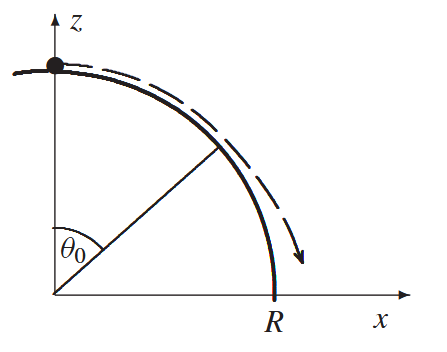
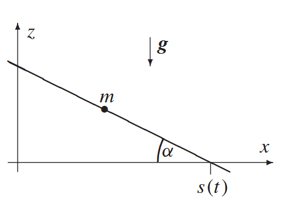
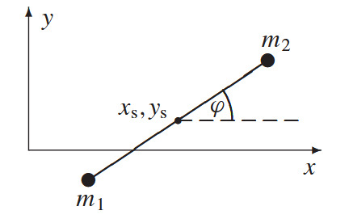

# Lagrangeformalismus

## Aufgabe 1: Massenpunkt auf Kurve im Schwerefeld

Ein Massenpunkt gleitet reibungsfrei auf der Kurve $z = f(x)$ in der $z$-$x$-Ebene unter Schwerkraft $F = -mg\mathbf{e}_z$. Stellen Sie die Lagrangegleichungen 1. Art auf.

## Aufgabe 2: Ablösung von Kugeloberfläche

Ein Massenpunkt startet vom obersten Punkt einer Kugel und gleitet reibungsfrei ab. Bestimmen Sie mit dem Energieerhaltungssatz den Ablösepunkt.

## Aufgabe 3: Hantel auf konzentrischen Kreisen

Zwei gleiche Massen $m$ sind durch eine Stange der Länge $L$ verbunden und bewegen sich reibungsfrei auf konzentrischen Kreisen mit Radien $r$ und $R$ ($R - r < L < R + r$). Unter Schwerkraft $g = -g\mathbf{e}_y$:

- Stellen Sie die Lagrangegleichungen 1. Art auf
- Bestimmen Sie die Gleichgewichtslage aus den Lagrangegleichungen und aus $U_{\text{pot}} = m(y_1 + y_2) = \text{minimal}$

## Aufgabe 4: Beschleunigte schiefe Ebene

Ein Massenpunkt gleitet reibungsfrei auf einer schiefen Ebene mit konstanter Neigung $\alpha$, die mit $s(t) = \frac{1}{2}at^2$ in $x$-Richtung beschleunigt wird.

- Geben Sie Zwangsbedingung und Lagrangegleichungen 1. Art an
- Lösen Sie die Bewegungsgleichungen und bestimmen Sie die Zwangskräfte

## Aufgabe 5: Kugelsymmetrisches Potenzial

Für ein Teilchen im kugelsymmetrischen Potenzial $U = U(r, t)$ in Kugelkoordinaten $(r, \theta, \phi)$:

- Stellen Sie die Lagrangefunktion auf
- Identifizieren Sie zyklische Koordinaten und die zugehörigen Erhaltungsgrößen

## Aufgabe 6: Homogenität der kinetischen Energie

Zeigen Sie für $T = \sum_{i,k} m_{ik}(q)\dot{q}_i\dot{q}_k$ mit $m_{ik} = m_{ki}$:

$$
\sum_n \dot{q}_n \frac{\partial T}{\partial \dot{q}_n} = 2T
$$

## Aufgabe 7: Teilchen im elektromagnetischen Feld

Für die Lagrangefunktion $\mathcal{L} = \frac{m}{2}\dot{r}^2 - q\Phi + \frac{q}{c}\dot{r}\cdot A$:

- Leiten Sie die Bewegungsgleichungen her und zeigen Sie $m\ddot{r} = q(E + \frac{\dot{r}}{c}\times B)$
- Berechnen Sie die Bahnkurve für $E = E_0\mathbf{e}_z$, $B = B_0\mathbf{e}_z$ mit Anfangsbedingungen $r(0) = 0$, $\dot{r}(0) = v_0\mathbf{e}_x$

## Aufgabe 8: Kleine Schwingungen des Doppelpendels

Für ein ebenes Doppelpendel:

- Formulieren Sie die Zwangsbedingungen und führen Sie $\varphi_1$, $\varphi_2$ als generalisierte Koordinaten ein
- Stellen Sie die Lagrangegleichungen auf und lösen Sie für kleine Schwingungen mit dem Ansatz $\phi_i(t) = a_i e^{i\omega t}$
- Diskutieren Sie die Fälle:

  1. $m_1 \ll m_2$
  2. $m_1 \gg m_2$ 
  3. $m_1 = m_2 = m$, $l_1 = l_2 = l$

## Aufgabe 9: Hantel mit Reibung

Eine Hantel (zwei Massen verbunden durch masselose Stange der Länge $L$) bewegt sich in der $x$-$y$-Ebene unter geschwindigkeitsproportionaler Reibung.

- Stellen Sie die Lagrangefunktion mit Koordinaten $(x_s, y_s, \varphi)$ auf
- Berechnen Sie die verallgemeinerten Reibungskräfte $Q_k$
- Geben Sie die allgemeine Lösung der Bewegungsgleichungen an

## Aufgabe 10: Eichtransformation der Lagrangefunktion

Zeigen Sie, dass $\mathcal{L}$ und $\mathcal{L} + \frac{d}{dt}f(q,t)$ dieselben Bewegungsgleichungen liefern.

## Aufgabe 11: Atwoodsche Fallmaschine

Zwei Massen $m_1$ und $m_2$ sind durch einen masselosen Faden der Länge $L$ verbunden, der über eine reibungsfreie Rolle läuft.

- Stellen Sie die Lagrangefunktion auf
- Lösen Sie die Bewegungsgleichungen
- Bestimmen Sie die Zwangskraft im Seil

## Aufgabe 12: Geladenes Teilchen in axialsymmetrischem Magnetfeld

Ein Teilchen der Ladung $q$ bewegt sich in einem axialsymmetrischen Magnetfeld $B = B(r,z)\mathbf{e}_z$.

- Stellen Sie die Lagrangefunktion in Zylinderkoordinaten auf
- Identifizieren Sie Erhaltungsgrößen
- Diskutieren Sie die Bahnbewegung für kleine Abweichungen von der Symmetrieachse